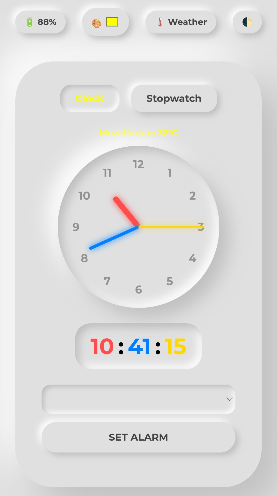
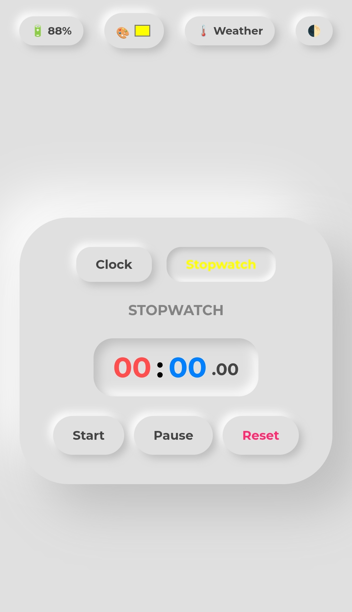

# 🕒 Real-Time Digital Clock

A stylish, accurate, and responsive Digital Clock web application. This project displays the current time with high precision and features a modern, user-friendly interface.

## Live Demo 🌐

**[Click Here](https://mdrajatech03.github.io/Clock/)**

## 🚀 Key Features

* **Real-Time Updates:** Displays current time (Hours, Minutes, Seconds) with zero lag.
* **Modern UI:** Minimalist design with vibrant colors and smooth typography.
* **12/24 Hour Format:** (Optional: include this if your code supports it).
* **Fully Responsive:** Adapts perfectly to mobile, tablet, and desktop screens.
* **Lightweight:** Built with pure Vanilla JavaScript for maximum performance.

---


## Screenshot 



## 🛠️ Tech Stack

* **HTML5:** Semantic markup for the clock structure.
* **CSS3:** Custom styling, glassmorphism effects, and responsive layout.
* **JavaScript (ES6):** `setInterval` and `Date()` object logic for real-time updates.

---

## ​👤 Author
**Rajatech**

[GitHub](http://GitHub.com/mdrajatech03)

## 📁 Project Structure

```text
Clock_Project/
├── index.html    # Core structure
├── style.css     # Design and animations
├── script.js     # Time logic and updates
└── README.md     # Documentation
